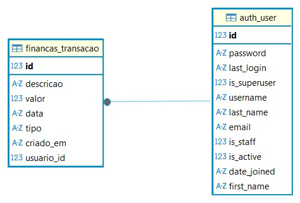
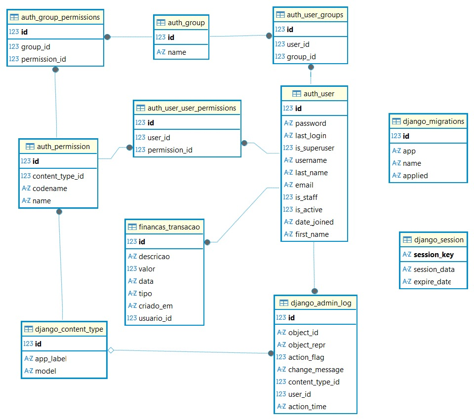

# Sistema Financeiro

## Descrição

Este é um sistema financeiro desenvolvido em Django, projetado para gerenciar contas pessoais e transações financeiras. O projeto inclui funcionalidades de autenticação de usuários, dashboard e formulários para entrada de dados financeiros.

## Funcionalidades

- Autenticação de usuários (login e registro)
- Dashboard para visualização de dados financeiros
- Formulários para entrada de transações
- Interface baseada em templates HTML
- Suporte a mensagens de feedback
- Configurado para português brasileiro

## Pré-requisitos

- Python 3.8 ou superior
- Django 5.0 ou superior
- SQLite (incluído por padrão no Django)

## Instalação

Siga os passos abaixo para configurar e executar o projeto localmente:

1. **Clone o repositório:**

   ```
   git clone <URL_DO_REPOSITORIO>
   cd sistema-financeiro
   ```

2. **Crie um ambiente virtual (opcional, mas recomendado):**

   ```
   python -m venv venv
   venv\Scripts\activate  # No Windows
   # ou
   source venv/bin/activate  # No Linux/Mac
   ```

3. **Instale as dependências:**

   ```
   pip install -r requirements.txt
   ```

4. **Execute as migrações do banco de dados:**

   ```
   python manage.py migrate
   ```

5. **Crie um superusuário (opcional, para acessar o admin):**

   ```
   python manage.py createsuperuser
   ```

6. **Execute o servidor de desenvolvimento:**

   ```
   python manage.py runserver
   ```

7. **Acesse o aplicativo:**
   Abra seu navegador e vá para `http://127.0.0.1:8000/`

## Como Usar

- Acesse a página inicial e faça login ou registre-se.
- Após o login, você será redirecionado para o dashboard.
- Use os formulários disponíveis para adicionar transações financeiras.
- Navegue pelas seções de contas e finanças conforme necessário.

## Diagrama Entidade-Relacionamento (DER)


Tabelas utilizadas

Diagrama completo
## Licença

Este projeto está licenciado sob a [MIT License](LICENSE).
